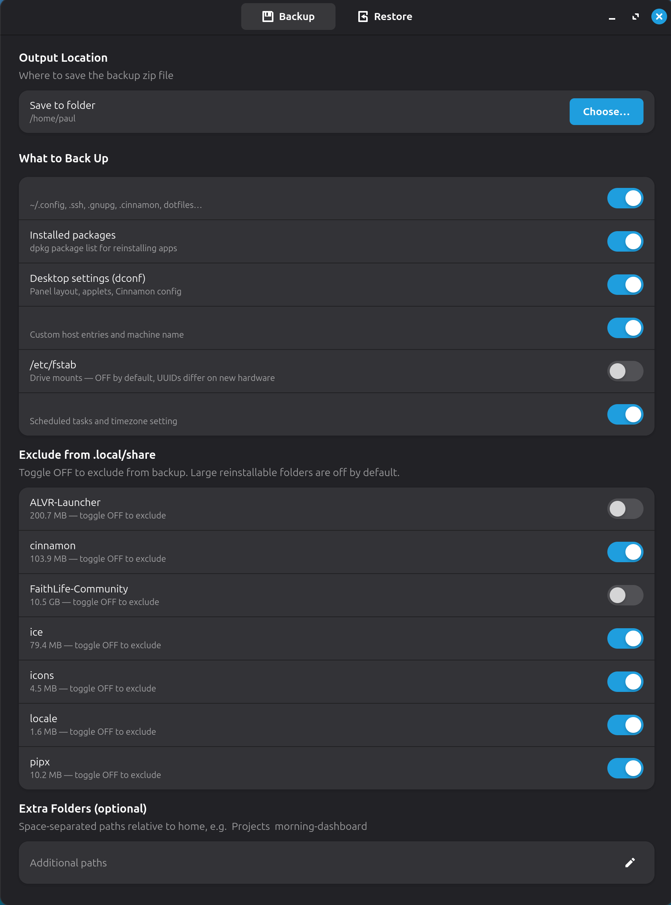

# Mint Migration Tool

A GTK4 GUI for backing up and restoring a Linux Mint system — home folder, installed packages, desktop settings, and system config — all into a single zip archive.



## Features

- **Backup** — home folder & dotfiles, dpkg package list, dconf desktop settings (panel layout, applets, Cinnamon config), and system files (`/etc/hosts`, `/etc/fstab`, `/etc/crontab`, timezone)
- **Restore** — extracts everything back on a new machine; system files written via polkit (no terminal needed)
- **Dry run** — preview exactly what will be backed up or restored without touching any files
- **Smart exclusions** — caches, `node_modules`, browser caches always excluded; large reinstallable folders (Steam, flatpak, VirtualBox, etc.) off by default with per-folder toggles
- **Claude Code** — backs up and restores `~/.claude` (AI assistant memory, hooks and config)
- **Extra paths** — add any additional home folder paths to the backup

## Install

### Option A — .deb package (recommended)

**[Download mint-migrate_1.2_all.deb](https://github.com/Paul163-ai/mint-migrate/releases/download/v1.2/mint-migrate_1.2_all.deb)**

Or browse the [Releases page](https://github.com/Paul163-ai/mint-migrate/releases/latest), then:

```bash
sudo dpkg -i mint-migrate_1.2_all.deb
```

Then find **Mint Migration Tool** in your application menu.

### Option B — From source

```bash
git clone https://github.com/Paul163-ai/mint-migrate.git
cd mint-migrate
bash install.sh
```

### Option C — Run directly

```bash
# Install dependencies
sudo apt install python3-gi python3-gi-cairo gir1.2-gtk-4.0 gir1.2-adw-1

python3 mint_migrate_gui.py
```

## Usage

1. **Backup tab** — choose an output folder, toggle what to include, click *Start Backup*. A timestamped zip (`mint-backup-YYYYMMDD-HHMMSS.zip`) is saved to the chosen location.
2. **Restore tab** — open the zip on the new machine, review what was found inside, click *Restore*. Package reinstall and system file restore will prompt for your password via polkit.

## Requirements

- Linux Mint (or any Cinnamon-based distro)
- Python 3.8+
- GTK 4 + libadwaita (`gir1.2-gtk-4.0`, `gir1.2-adw-1`)
- `dconf` (usually pre-installed on Mint)
